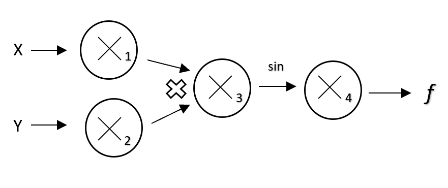

# Milestone 1

## Introduction

Automatic differentiation is a tool for calculating derivatives using machine accuracy. It has several advantages over traditional methods of derivative calculations such as symbolic and finite differentiation. Automatic differentiation is useful for calculating complex derivatives where errors are more likely with classical methods. For instance , with finite differentiation, h values that are too small will lead to accuracy errors though floating point roundoff error, while h values that are too large will start making vastly inaccurate approximations. 

Automatic differentiation is useful due to its practicality in real world applications that involve thousands of parameters in a complicated function, which would take a long runtime as well as strong possibility for error in calculating the derivatives individually. 

Our package allows users to calculate derivatives of complex functions, some with many parameters, allowing machine precision.

## Background

Essentially automatic differentiation works by  breaking down a complicated function and performing a sequence of elementary arithmetic such as addition, subtraction, multiplication, and division as well as elementary functions like exp, log, sin, etc. These operations are then repeated by the chain rule and the derivatives of these sequences are calculated. There are two ways that automatic differentiation can be implemented - forward mode and reverse mode. 


### 2.1 The Chain Rule

The chain rule makes up a fundamental component of auto differentiation. The basic idea is:   
For univariate function, $$ F(x) = f(g(x))$$
 $$F^{\prime} = (f(g))^{\prime} = f^{\prime}(g(x))g^{\prime}(x)$$
For multivariate function, $$F(x) = f(g(x),h(x))$$
$$ \frac{\partial F}{\partial x}=\frac{\partial f}{\partial g} \frac{\partial g}{\partial x}+\frac{\partial f}{\partial h} \frac{\partial h}{\partial x}$$
For more generalized cases, if F is a combination of more sub-functions,  $$F(x) = f(g_{1}(x), g_{2}(x), …, g_{m}(x))$$
$$\frac{\partial F}{\partial x}=\sum_{i=1}^{m}\frac{\partial F}{\partial g_{i}} \frac{\partial g_{i}}{\partial x}$$

### 2.2 Forward Mode

The forward mode automatic differentiation is accomplished by firstly splitting the function process into one-by-one steps, each including only one basic operation. Then from the first node, the value and derivative will be calculated based on the values and derivatives of forward nodes. An example of computational graph and table for forward mode AD is shown as follows:



\begin{align}
  f\left(x,y\right) =\sin\left(xy\right)
\end{align}
We will be evaluating the function at $f(1, 0)$

Evaluation trace:

| Trace   | Elementary Function      | Current Value           | Elementary Function Derivative       | $\nabla_{x}$ Value  | $\nabla_{y}$ Value  |
| :---: | :-----------------: | :-----------: | :----------------------------: | :-----------------:  | :-----------------: |
| $x_{1}$ | $x_{1}$                  | $1$        | $\dot{x}_{1}$                        | $1$ | $0$ |
| $x_{2}$ | $x_{2}$                  | $0$        | $\dot{x}_{2}$                        | $0$ | $1$ |
| $x_{3}$ | $x_{1}x_{2}$                  | $0$        | $\dot{x}_{2}$                        | $0$ | $1$ |

### 2.3 Reverse Mode

The reverse mode automatic differentiation has a process similar to the forward mode auto differentiation, but has another reverse process. It does not apply the chain rule and only partial derivatives to a node are stored. First, for the forward process, the partial derivatives are stored for each node. For the reverse process, it starts with the differentiation to the last node, and then activations in the forward process are deployed in the differentiation differentiation step by step. 


### 2.4 Forward Mode v.s. Reverse Mode

Two main aspects can be considered when choosing between Forward and Reverse mode auto differentiation.
* Memory Storage & Time of Computation

The forward mode needs memory storage for values and derivatives for each node, while the reverse mode only needs to store the activations of partial differentiation to each node. The forward mode do the computation at the same time as the variable evaluation, while the reverse mode do the calculation in the backward process.
* Input & Output Dimensionality

If the input dimension is much larger than output dimension, then reverse mode is more attractive. If the output dimension is much larger than the input dimension, the forward mode is much computational cheaper.


## How to use VorDiff

The two main objects you will interact with are imported below:
```py
from VorDiff import autodiff as ad
from VorDiff import operator as op
```
In short, the user will first instantiate a variable (scalar or vector) as an `autodiff` object, and then feed those variables to operators in the `operator` object. The user will be able to retrieve the resulting values and derivatives after doing so.

The user may instantiate an `autodiff` object by the following:
```py
x = ad.create_scalar(val = 4)
v = ad.create_vector(vals = [4,2]
```
Then, the `operator` class can be used to define functions. Simple operations (addition, subtraction, multiplication, and division) may be used normally. More complex functions (e.g. sqrt, sin, cos) must use the operations defined in the `operator` class.
```py
fx = 4*op.sqrt(x) + x
fv = 4*op.sqrt(v) + v
```
The user may retrieve the values and first derivatives from the objects defined above by using the `val` and `der` attributes of the `autodiff` object.
```py
print(fx.val, fx.der)
print(fv.val, fv.der)
```
For vectors, `val` and `der` will be tuples that contain the values and partial derivatives, respectively, at each element of the vector.

## Software Organization

### Directory Structure
The package's directory will be structured as follows:
```
VorDiff/
	__init__.py
	operators/
	    __init__.py
	    operator.py
	nodes/
	    __init__.py
	    node.py
	    scalar.py
	    vector.py
	tests/
	    __init__.py
	    test_operators/
		    test_operator.py
	    test_nodes/
		    test_node.py
		    test_scaler.py
		    test_vector.py
		test_autodiff.py
	docs/
		...
	examples/
	    __init__.py
	    ...
	autodiff.py 
    README.md
    setup.py
    ...
```
### Modules
-   VorDiff: The VorDiff module contains the operator class to be directly used by users to evaluate functions and calculate their derivatives, a superclass node and subclasses scalar and vector to be used in autodiff class, and an autodiff class to perform automatic differentiation. This is the core of the package.
    
-   Test_Vordiff: The Test_Vordiff module contains the test suite for this project. TravisCI and CodeCov are used to test our operator classes, node classes, and auto-differentiator.
    
-   Examples: The Examples module contains python files demonstrating how to perform automatic differentiation with the implemented functions.
    
### Testing
In this project we will use TravisCI to perform continuous integration testing and CodeCov to check the code coverage of our test suite. The status us TravisCI and CodeCov can be found in README.md, in the top level of our package. Since the test suite is included in the project distribution, users can also install the project package and use pytest and pytest-cov to check the test results locally.

### Distribution:
Our open-source VorDiff package will be uploaded to PyPI by using twine because it uses a verified connection for secure authentication to PyPI over HTTPS. Users will be able to install our project package by using the convential `pip install VorDiff`.


## Implementation

